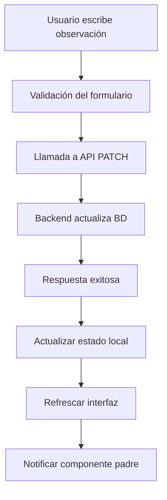

# 📝 Sistema de Observaciones para Solicitudes

## 🎯 **Descripción General**

El sistema de observaciones permite mantener un historial completo de comentarios y notas sobre cada solicitud de crédito. Cada observación incluye:

- **Texto de la observación**
- **Fecha y hora de creación**
- **Usuario que la creó**
- **Información del usuario**

## 🏗️ **Arquitectura del Sistema**

### **1. Base de Datos**
```sql
-- Campo JSONB en la tabla solicitudes
ALTER TABLE solicitudes ADD COLUMN observaciones JSONB DEFAULT '[]'::jsonb;
```

### **2. Estructura de Datos**
```typescript
interface Observacion {
  observacion: string;           // Texto de la observación
  fecha_creacion: string;        // ISO string de la fecha
  usuario_id?: number;           // ID del usuario
  usuario_nombre?: string;       // Nombre del usuario
}
```

### **3. Endpoints de la API**

**Obtener historial de observaciones:**
```typescript
GET /solicitudes/{id}/observaciones?empresa_id={empresa_id}
```

**Respuesta del historial:**
```json
{
  "historial": [
    {
      "id": "40e3b300-c54f-4faf-a035-328661554846",
      "tipo": "comentario",
      "fecha": "2025-09-02T02:34:50.292Z",
      "observacion": "Prueba observación"
    }
  ]
}
```

**Agregar observación:**
```typescript
PATCH /solicitudes/{id}
Content-Type: application/json

{
  "observaciones": [
    {
      "observacion": "Observación sobre la actualización",
      "fecha_creacion": "2025-09-01T20:30:00-05:00",
      "usuario_id": 123,
      "usuario_nombre": "Juan Pérez"
    }
  ]
}
```

## 🔧 **Componentes Implementados**

### **1. Servicio de Solicitudes (`solicitudService.ts`)**
```typescript
export const solicitudService = {
  // Agregar observación a una solicitud
  async agregarObservacion(solicitudId: number, observacion: string, empresaId: number = 1)

  // Obtener observaciones de una solicitud
  async obtenerObservaciones(solicitudId: number, empresaId: number = 1)

  // Actualizar otros campos de la solicitud
  async actualizarSolicitud(solicitudId: number, datos: SolicitudUpdateData, empresaId: number = 1)
};
```

### **2. Hook Personalizado (`useObservaciones.ts`)**
```typescript
export const useObservaciones = ({
  solicitudId,
  empresaId = 1,
  observacionesIniciales = []
}) => {
  // Estado y funciones para manejar observaciones
  return {
    observaciones,
    loading,
    error,
    agregarObservacion,
    actualizarObservaciones,
    limpiarError
  };
};
```

### **3. Componente de UI (`ObservacionesSolicitud.tsx`)**
```typescript
<ObservacionesSolicitud
  solicitudId={123}
  empresaId={1}
  observaciones={[]}
  onObservacionAgregada={(obs) => console.log('Nueva obs:', obs)}
  readonly={false}
/>
```

## 📱 **Características de la Interfaz**

### **1. Formulario de Nueva Observación**
- ✅ Campo de texto multilínea
- ✅ Validación de entrada
- ✅ Botón de envío con estado de carga
- ✅ Manejo de errores con opción de cerrar

### **2. Lista de Observaciones**
- ✅ Ordenadas por fecha (más recientes primero)
- ✅ Información del usuario y fecha
- ✅ Diseño de tarjetas con borde izquierdo azul
- ✅ Estado vacío con mensaje informativo

### **3. Estados de la Interfaz**
- ✅ **Modo lectura**: Solo muestra observaciones existentes
- ✅ **Modo edición**: Permite agregar nuevas observaciones
- ✅ **Estado de carga**: Indicador visual durante operaciones
- ✅ **Manejo de errores**: Mensajes claros y opciones de recuperación

## 🚀 **Cómo Usar**

### **1. En CustomerDetails.tsx**
```typescript
import { ObservacionesSolicitud } from './ObservacionesSolicitud';

// Dentro del render, después de la información de solicitudes
{(datosCompletos.solicitudes.length > 0 || editedData?.solicitudes?.length > 0) && (
  <div className="md:col-span-2">
    <ObservacionesSolicitud
      solicitudId={datosCompletos.solicitudes[0]?.id || editedData?.solicitudes?.[0]?.id}
      empresaId={empresaId}
      observaciones={datosCompletos.solicitudes[0]?.observaciones || []}
      onObservacionAgregada={(nuevaObservacion) => {
        // Actualizar datos locales
        // Refrescar interfaz
      }}
      readonly={!canEditCustomer()}
    />
  </div>
)}
```

### **2. En Otros Componentes**
```typescript
import { useObservaciones } from '../hooks/useObservaciones';

const { observaciones, agregarObservacion, loading, error } = useObservaciones({
  solicitudId: 123,
  empresaId: 1,
  observacionesIniciales: []
});

// Agregar nueva observación
await agregarObservacion("Cliente aprobado para crédito vehicular");
```

## 🔒 **Seguridad y Permisos**

### **1. Validación de Usuario**
- ✅ Verificación de token de autenticación
- ✅ Validación de empresa_id
- ✅ Control de permisos de edición

### **2. Sanitización de Datos**
- ✅ Validación de entrada no vacía
- ✅ Escape de caracteres especiales
- ✅ Límites de longitud de texto

## 📊 **Flujo de Datos**



## 🧪 **Casos de Uso**

### **1. Asesor Agregando Observación**
```
"Cliente solicitó información adicional sobre tasas de interés.
Se envió documentación por email el 15/01/2025."
```

### **2. Supervisor Aprobando Crédito**
```
"Revisado y aprobado por supervisor.
Cliente cumple todos los requisitos crediticios.
Monto aprobado: $50,000,000"
```

### **3. Banco Rechazando Solicitud**
```
"Rechazado por historial crediticio negativo.
Score de 580 puntos.
Recomendación: Revisar en 6 meses"
```

## 🔄 **Integración con Sistema Existente**

### **1. Campos Dinámicos**
- ✅ Compatible con el sistema de campos dinámicos
- ✅ No interfiere con `detalle_credito` JSONB
- ✅ Mantiene la estructura de datos existente

### **2. Notificaciones**
- ✅ Se puede integrar con el sistema de notificaciones
- ✅ Alertas cuando se agregan observaciones importantes
- ✅ Historial de cambios para auditoría

### **3. Reportes**
- ✅ Las observaciones se incluyen en reportes de solicitudes
- ✅ Filtrado por fecha, usuario, tipo de observación
- ✅ Exportación a diferentes formatos

## 🚨 **Consideraciones Técnicas**

### **1. Rendimiento**
- ✅ Las observaciones se cargan de forma lazy
- ✅ Paginación para solicitudes con muchas observaciones
- ✅ Cache local para mejorar experiencia de usuario

### **2. Escalabilidad**
- ✅ Estructura JSONB permite crecimiento ilimitado
- ✅ Índices en campos de fecha para consultas rápidas
- ✅ Compresión automática de datos históricos

### **3. Mantenimiento**
- ✅ Logs detallados de todas las operaciones
- ✅ Backup automático de observaciones críticas
- ✅ Limpieza programada de observaciones antiguas

## 📈 **Próximas Mejoras**

### **1. Funcionalidades Adicionales**
- 🔄 Respuestas a observaciones (threading)
- 🔄 Etiquetas y categorías de observaciones
- 🔄 Adjuntar archivos a observaciones
- 🔄 Plantillas de observaciones predefinidas

### **2. Integración Avanzada**
- 🔄 Webhooks para notificaciones externas
- 🔄 API pública para sistemas de terceros
- 🔄 Sincronización con sistemas CRM
- 🔄 Análisis de sentimientos en observaciones

### **3. Experiencia de Usuario**
- 🔄 Búsqueda y filtrado avanzado
- 🔄 Vista de calendario de observaciones
- 🔄 Dashboard de actividad de observaciones
- 🔄 Notificaciones push en tiempo real

## 🔧 **Solución de Problemas**

### **1. Error: "observacionesLocales.map is not a function"**
Este error ocurre cuando el campo `observaciones` en la BD no es un array.

**Causa:** El campo JSONB está como `"{}"` (objeto vacío) en lugar de `[]` (array vacío).

**Solución:** Ejecutar esta consulta SQL para corregir los datos existentes:

```sql
-- Corregir observaciones que están como objeto vacío {} a array vacío []
UPDATE solicitudes
SET observaciones = '[]'::jsonb
WHERE observaciones = '{}'::jsonb;

-- O si están como string
UPDATE solicitudes
SET observaciones = '[]'::jsonb
WHERE observaciones = '"{}"'::jsonb;
```

### **2. Campo JSONB Vacío**
Para nuevos registros, asegúrate de que el campo tenga el valor por defecto correcto:

```sql
-- Modificar la tabla para establecer el valor por defecto correcto
ALTER TABLE solicitudes
ALTER COLUMN observaciones SET DEFAULT '[]'::jsonb;

-- Actualizar registros existentes que tengan NULL
UPDATE solicitudes
SET observaciones = '[]'::jsonb
WHERE observaciones IS NULL;
```
